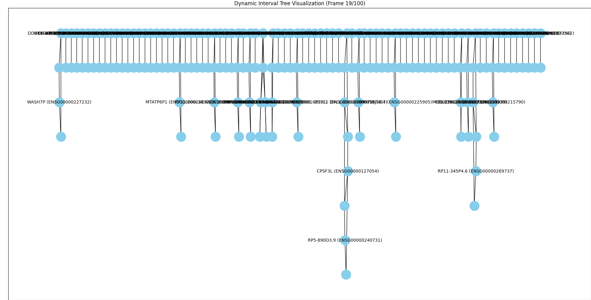

# Running

## Preprocess
### Get original dataset

`wget ftp://ftp.ensembl.org/pub/release-85/gff3/homo_sapiens/Homo_sapiens.GRCh38.85.gff3.gz`

Read more about it here: https://www.toptal.com/python/comprehensive-introduction-your-genome-scipy

### Get intermediate files
`python3 build_datasets.py`

> This generates the dataset gene_data.pkl

`python3 get_nodes_edges_of_genes.py`

> this generates node_data.json and edge_data.json. They are not ultimetaly used since I haven't still found a way to render them properly using react flow.

## run simulation
`python3 gen.py`

